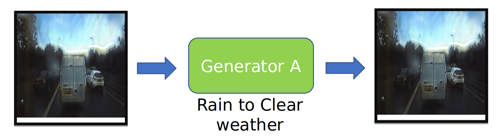

# Restoration of degraded images captured during adverse weather conditions with Generative Adversarial Networks

## Dataset
The model has been trained on the Radiate dataset.  

## Dependencies
* Tensorflow
* Matplotlib

## Cycle-GAN
### Network layout

### Forward consistency loss

### Backward consistency loss

### Identity loss

## Results

## Summary
Observed significant improvement in the results in the early iterations. But, after a while the GAN network trades-off diversity to fidelity and hence, tries to augment vehicles/generate trees inplace of rain drops etc. Concluding with this as the limitation of GAN/Cycle-GAN.

The report of this project can be found in the below link. 
[report](report/Report.pdf)
